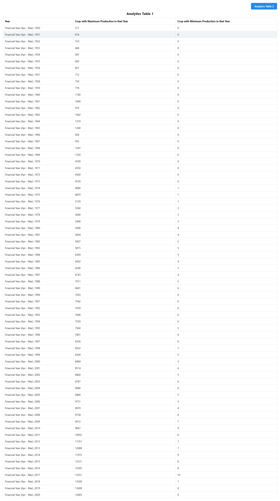
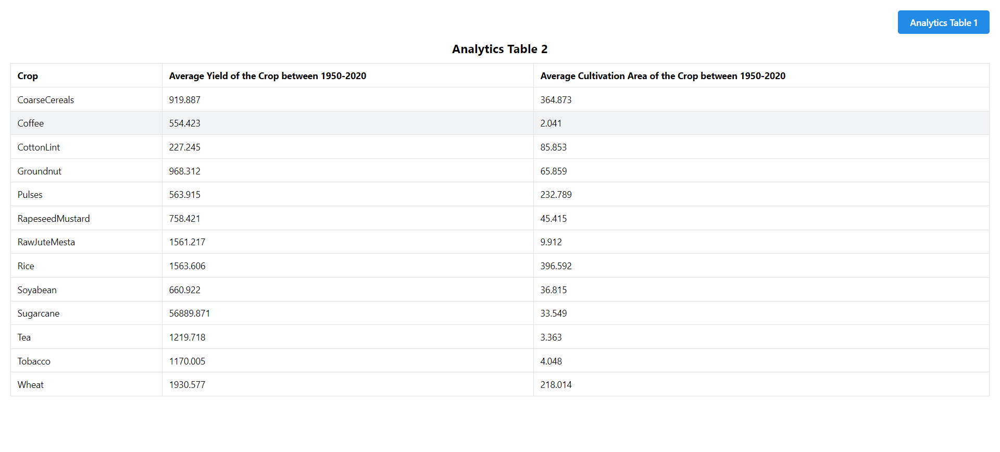

# My React Project

Welcome to My React Project! This project is a Manufac Task-  Indian Agriculture dataset

## Prerequisites

Before you begin, ensure you have met the following requirements:

- Node.js installed on your local machine
- Yarn package manager installed on your local machine

## Installation

To install the project dependencies, follow these steps:

1. Clone the repository:
   git clone https://github.com/your-username/my-react-project.git

2. Install dependencies using Yarn:
   yarn install

3. Start the development server:
   yarn start

4. To build the project for production, follow these steps:
   yarn build

# Agriculture Analytics Dashboard
Agriculture Analytics Dashboard is a web application that provides insights into crop production data, allowing users to analyze trends and make informed decisions.

# Usage
Once the development server is running, open your web browser and navigate to http://localhost:3000 to access the Agriculture Analytics Dashboard. You can view crop production data, analyze trends, and generate reports.

## Path
my-agriculture-project ( Task)/
  README.md
  node_modules/
  package.json
  public/
    index.html
    favicon.ico
    screenshots/
      screenshot1.png
      screenshot2.png
  src/
    ...

# Screenshots

Figure 1: Overview of the Agriculture Analytics -Yearly Wise 

Figure 1: Overview of the Agriculture Analytics  - Average
